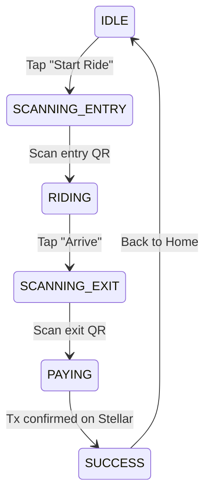

# QRyde 🛺

QR-based tricycle fare payment app built on the **Stellar** blockchain. Scan a QR code to start your ride, track your route on a live map, and pay automatically when you arrive — all settled on-chain.

## Features

- **📷 QR Entry/Exit** — Scan the driver's printed QR to start a ride; scan again at your destination to pay. Deep-link scheme: `qryde:entry?driver=KEY&vehicle=PLATE`
- **🗺️ Live Map Navigator** — GPS-tracked route with Leaflet map showing your start point (green pin), current position (blue pin), and full traveled path (dark green polyline)
- **📡 GPS Distance Tracking** — Real-time haversine-based distance calculation with simulated fallback when GPS is unavailable
- **💥 Crash Detection** — Accelerometer-based collision sensing (triggers alert at >4G)
- **💸 Stellar Payments** — Fares settled on-chain via Freighter wallet. Supports XLM and PHPC (Stellar USDC-equivalent)
- **📜 Ride History** — All past rides persisted locally with fare breakdowns and on-chain transaction links
- **👨‍✈️ Driver Mode** — Generate entry/exit QR codes for drivers with vehicle plate info
- **💰 Top-Up** — Add funds to your wallet

## Tech Stack

| Layer | Technology |
|-------|-----------|
| Framework | [Next.js 16](https://nextjs.org/) (Turbopack) |
| UI | React 19, SCSS modules |
| Maps | [Leaflet](https://leafletjs.com/) + [react-leaflet](https://react-leaflet.js.org/) |
| QR Scanning | [html5-qrcode](https://github.com/mebjas/html5-qrcode) |
| Blockchain | [Stellar SDK](https://stellar.org/) + [Freighter API](https://freighter.app/) |
| Icons | [react-icons](https://react-icons.github.io/) (Feather) |
| Language | TypeScript |

## Getting Started

### Prerequisites

- **Node.js** ≥ 18
- **npm** ≥ 9
- [Freighter browser extension](https://freighter.app/) (for wallet/ payments)

### Install & Run

```bash
# Install dependencies
npm install

# Start dev server (with Turbopack)
npm run dev
```

Open [http://localhost:3000](http://localhost:3000) in your browser.

### Access from other devices on your network

The dev server binds to your local IP automatically (e.g. `http://172.16.0.25:3000`). If you see cross-origin warnings, add your IP to `allowedDevOrigins` in `next.config.ts`.

## Project Structure

```
src/
├── app/
│   ├── _components/
│   │   ├── QrydeProvider.tsx       # Global state (wallet, ride, history)
│   │   ├── layout/
│   │   │   ├── BottomNav.tsx
│   │   │   └── PhoneShell.tsx      # Mobile shell wrapper
│   │   └── qryde/
│   │       ├── RideFlow.tsx        # Main ride state machine
│   │       ├── QrScanner.tsx       # QR camera scanner
│   │       ├── MapNavigator.tsx    # Leaflet map with path tracing
│   │       ├── DriverScreen.tsx    # Driver QR generation
│   │       ├── HomeScreen.tsx
│   │       ├── HistoryScreen.tsx
│   │       ├── ProfileScreen.tsx
│   │       ├── TopUpScreen.tsx
│   │       ├── useGeolocation.ts   # GPS + haversine distance
│   │       ├── useAccelerometer.ts # Motion/crash detection
│   │       ├── useRide.ts          # Ride state machine
│   │       ├── stellarService.ts   # Stellar tx signing & submission
│   │       └── types.ts            # Shared types + fare logic
│   ├── driver/page.tsx
│   ├── history/page.tsx
│   ├── profile/page.tsx
│   ├── ride/page.tsx
│   ├── topup/page.tsx
│   ├── hooks/                      # Wallet, balances, FX rate hooks
│   ├── lib/                        # Stellar config, payment, pricing
│   └── styles/                     # SCSS (variables, components, screens)
```

## Ride Flow



## Fare Calculation

| Component | Amount |
|-----------|--------|
| Base fare | ₱15.00 |
| Per kilometer | ₱2.00 |

On-chain settlement uses XLM by default. If the user has a PHPC trustline (Stellar USDC-equivalent), payment is sent in PHPC directly.

## License

Private — QRyde
